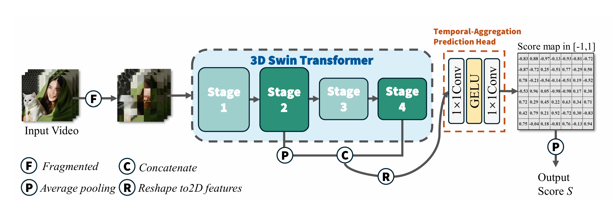

# TemporalQA
Official repo for paper "TemporalQA: A Learned Perceptual Temporal Consistency Model for Video Quality Assessment" (PRCV'26)).

We introduce VideoTC, a large-scale dataset composed of versatile synthesized videos and human annotations of temporal consistency scores. Building upon this foundation, we propose TemporalQA, a novel learned perceptual neural network designed to quantify temporal consistency. The architecture leverages a multi-scale 3D Swin Transformer backbone to extract hierarchical spatiotemporal features, which are then processed by a temporal-aggregation head to predict a consistency score map.

## VideoTC Dataset

**[Download VideoTC Dataset](https://drive.google.com/drive/folders/1t8Q_0GY3fUkXWWPCFbmelGaYebkSYzJt)**

VideoTC is a large-scale temporal consistency dataset containing 2,160 AI-generated videos together with human annotations of their temporal consistency scores. The folder holds the videos as well as the per-type and overall annotation files, described below.

| File | Description |
| --- | --- |
| `VideoTCdataset.zip` | 2,160 AI-generated videos (.mp4). |
| `itype_color.json` | Videos annotated as temporally inconsistent in *color*, together with their scores. |
| `itype_shape.json` | Videos annotated as temporally inconsistent in *shape*, together with their scores. |
| `itype_texture.json` | Videos annotated as temporally inconsistent in *texture*, together with their scores. |
| `human_rating.json` | All video names and their corresponding human-annotated temporal consistency scores. |

After the download is complete, place all files under `TemporalQA/` and extract `VideoTCdataset.zip`. The directory structure should be as follows:

The train/val/test splits are provided in the file ``.

## Environment

Run `conda env create -f environment.yml` to create a new conda environment called `video_eval`.

## Pre-trained Weights

## Training

## Testing
